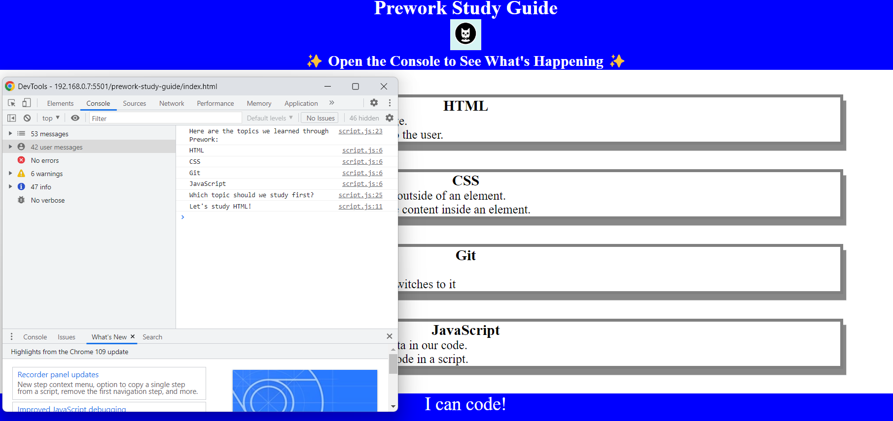

# Prework Study Guide Webpage

## Description

I have created this project to help me apply what I have learned during the bootcamp prework. It has allowed me to better understand how each language is working and what they are used for. I have learned how to structure and orgonise a project on Git responsibly.

## Installation

N/A

## Usage

The website can be used to find basic information about HTML, CSS, Git and JavaScript.

The website can be used to inspect the use of JavaScript by opening the developer tools.

## Credits

N/A

## License

Please refer to the LICENCE in the repo.

## Badges

N/A

## Features

N/A

## How to Contribute

N/A

## Tests

N/A
